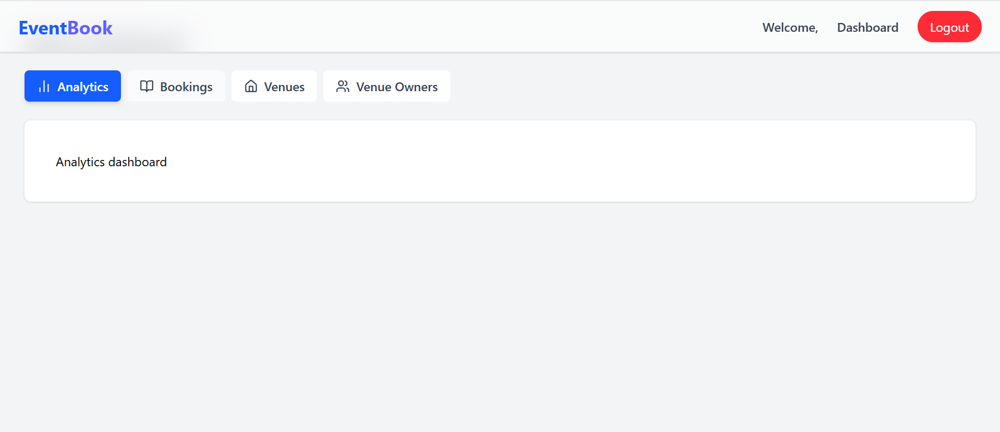
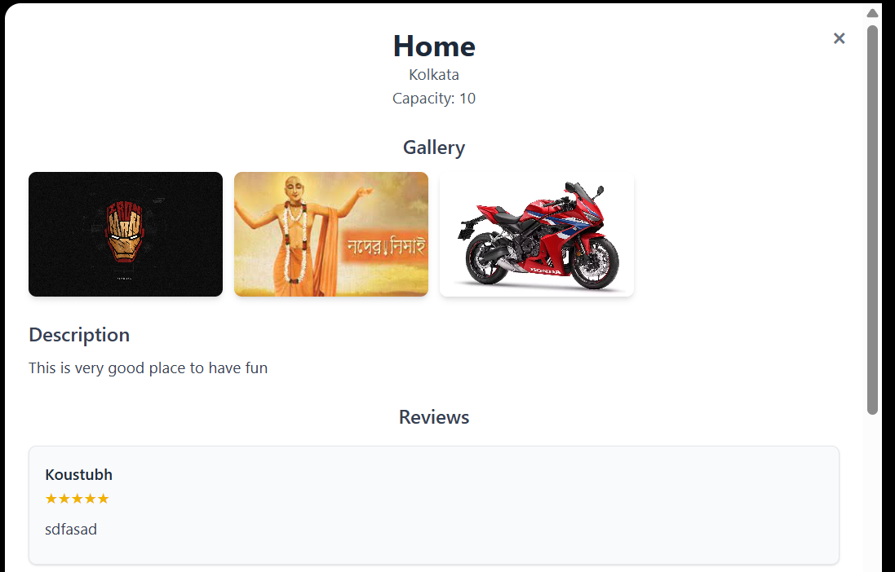

# Event and Venue Management & Booking System


## Introduction

Managing events and venues manually can be time-consuming, error-prone, and inefficient. Whether it's finding the right venue, handling bookings, or tracking event details, stakeholders often face challenges due to lack of centralized systems. This project aims to solve that by providing a digital platform that simplifies and automates the entire event and venue management lifecycle.


## My Solution

The **Event and Venue Management & Booking System** is a full-stack web application designed to streamline venue discovery, booking, and event coordination. It offers:

- A responsive frontend built with **React.js** and styled using **Tailwind CSS**.
- A robust backend powered by **.NET 8**, handling business logic and API services.
- A secure and scalable **PostgreSQL** database for storing user, venue, booking, and review data.
- Role-based access for **Customers**, **Venue Owners**, and **Admins**.
- Real-time booking management, review system, and admin analytics dashboard.

## Project Summary
The Event and Venue Management & Booking System is a comprehensive platform designed to streamline the management, booking, and administration of venues and events. It enables venue owners, event organizers, and customers to efficiently handle the entire event lifecycle, from listing and booking venues to managing payments, schedules, and reviews. The system facilitates real-time availability checks, secure booking, and provides reviews for better decision-making.

This platform bridges the gap between venue providers and customers, offering an intuitive and reliable digital solution that enhances operational efficiency and improves the overall user experience.

## Project Scope
- Centralized platform for venue listing and booking
- Role-based access for customers, venue owners, and admins
- Real-time availability and booking management
- Review and rating system for venues
- Admin dashboard for monitoring and reporting

## User Features
### User Registration & Authentication
- Secure login/sign-up with email and token
- Role-based access (Customer, Venue Owner, Admin)

### Venue Search & Booking
- Browse venues by location, capacity, type, and availability
- View detailed venue profiles with images, pricing, and capacity
- Book venues in real-time

### Booking Management
- Track booking status (Pending, Confirmed, Cancelled)
- Receive notifications for booking updates

### Reviews & Ratings
- Leave reviews for venues
- Rate venues based on services and amenities

## Venue Owner Features
### Venue Management
- Add, update, and remove venue listings
- Set pricing, capacity, and description
- Upload gallery images

### Booking Approval & Management
- Approve or reject booking requests
- View upcoming bookings and generate reports

## Admin Features
### Reports & Analytics
- Generate detailed reports for bookings, revenue, and customer engagement
- Identify top-performing venues and user trends

## Workflow
1. **User Registration/Login**: Users register or log in to the system and select their role.
2. **Venue Browsing**: Users browse available venues with filters for location, type, capacity, and date.
3. **Booking Process**: Users select a venue, choose a date/time, and book online.
4. **Booking Approval**: Venue owners receive booking requests and confirm or reject them.
5. **Event Execution & Review**: Users attend the event, and post-event reviews can be submitted.
6. **Admin Oversight**: Admins monitor all activities, generate reports, and ensure smooth operations.


## Time Estimation

| Module                     | Estimated Time | Expected Date |
|----------------------------|----------------|----------------|
| Project Documentation      | 2 days         | 2025-10-15     |
| User Authentication        | 2 days         | 2025-10-17     |
| Venue Management           | 3 days         | 2025-10-19     |
| Booking System             | 3 days         | 2025-10-22     |
| Review System              | 2 days         | 2025-10-25     |
| Admin Dashboard            | 2 days         | 2025-10-27     |
| API Integration            | 3 days         | 2025-10-29     |
| Final Review & Refactoring | 6 days         | 2025-11-01     |
| **Total**                  | **23 days**    | -              |

## API Design
### User APIs
| Method | Endpoint | Description |
|--------|----------|-------------|
| POST   | /api/users/register | Register a new user |
| POST   | /api/users/login | Authenticate a user |
| GET    | /api/users/profile | Retrieve user profile |


### Venue APIs

| Method | Endpoint                                | Description                          |
|--------|-----------------------------------------|--------------------------------------|
| GET    | /api/venues                             | List all venues with optional filters |
| GET    | /api/venues/{id}                        | Get details of a specific venue       |
| POST   | /api/venue/create                       | Add a new venue (Owner/Admin)        |
| PUT    | /api/venue/update/{id}                  | Update venue details                 |
| DELETE | /api/venue/delete/{id}                  | Delete a venue                       |
| POST   | /api/venues/{venueId}/images            | Upload venue images                  |
| POST   | /api/venues/{venueId}/pricing           | Add venue pricing for listing        |
| PUT    | /api/venues/{venueId}/pricing/{pricingId} | Update venue pricing    


### Booking APIs
| Method | Endpoint | Description |
|--------|----------|-------------|
| POST   | /api/bookings | Create a new booking |
| GET    | /api/bookings/user/{userId} | List bookings for a user |
| PUT    | /api/bookings/{bookingId}/status | Update booking status (Approved/Rejected) |
| DELETE | /api/bookings/{bookingId} | Cancel a booking |


### Payment APIs
| Method | Endpoint                      | Description                          |
|--------|-------------------------------|--------------------------------------|
| POST   | /api/payment/create           | Create a payment for a booking       |


### Review APIs
| Method | Endpoint | Description |
|--------|----------|-------------|
| POST   | /api/reviews | Add a review for a venue |
| GET    | /api/reviews/venue/{venueId} | Get all reviews for a venue |

### Admin APIs
| Method | Endpoint | Description |
|--------|----------|-------------|
| GET    | /api/admin/users | List all users |
| GET    | /api/admin/venues | List all venues |
| GET    | /api/admin/bookings | List all bookings |
| GET    | /api/admin/reports | Generate system-wide reports |

## Schemas
```sql
CREATE TABLE IF NOT EXISTS users (
    userid SERIAL PRIMARY KEY,
    name VARCHAR(100) NOT NULL,
    email VARCHAR(100) NOT NULL UNIQUE,
    passwordhash VARCHAR(255) NOT NULL,
    role VARCHAR(50) NOT NULL CHECK (role IN ('Admin', 'VenueOwner', 'Customer')),
    createdat TIMESTAMP NOT NULL DEFAULT CURRENT_TIMESTAMP,
    updatedat TIMESTAMP NOT NULL DEFAULT CURRENT_TIMESTAMP
);

CREATE TABLE IF NOT EXISTS venues(
    venueid SERIAL PRIMARY KEY,
    name VARCHAR(255) NOT NULL,
    location VARCHAR(255) NOT NULL,
    capacity INT NOT NULL,
    description TEXT,
    ownerid INT NOT NULL REFERENCES users(userid),
    createdat TIMESTAMP NOT NULL DEFAULT CURRENT_TIMESTAMP,
    updatedat TIMESTAMP NOT NULL DEFAULT CURRENT_TIMESTAMP
);

CREATE TABLE IF NOT EXISTS venue_images (
    venueimageid SERIAL PRIMARY KEY,
    venueid INT NOT NULL REFERENCES venues(venueid) ON DELETE CASCADE,
    imageurl TEXT NOT NULL,
    createdat TIMESTAMP NOT NULL DEFAULT CURRENT_TIMESTAMP
);

CREATE TABLE IF NOT EXISTS venue_pricings (
    venuepricingid SERIAL PRIMARY KEY,
    venueid INT NOT NULL REFERENCES venues(venueid) ON DELETE CASCADE,
    type VARCHAR(50) NOT NULL,
    price NUMERIC(12, 2) NOT NULL,
    createdat TIMESTAMP NOT NULL DEFAULT CURRENT_TIMESTAMP
);

CREATE TABLE IF NOT EXISTS bookings (
    bookingid SERIAL PRIMARY KEY,
    venueid INT NOT NULL REFERENCES venues(venueid) ON DELETE CASCADE,
    customerid INT NOT NULL REFERENCES users(userid) ON DELETE CASCADE,
    bookingdate TIMESTAMP NOT NULL,
    timeduration INT NOT NULL,
    totalprice NUMERIC(10,2) NOT NULL,
    status VARCHAR(50) NOT NULL,
    createdat TIMESTAMP NOT NULL DEFAULT NOW()
);

CREATE TABLE IF NOT EXISTS venue_reviews (
    reviewid SERIAL PRIMARY KEY,
    venueid INT NOT NULL REFERENCES venues(venueid) ON DELETE CASCADE,
    userid INT NOT NULL REFERENCES users(userid) ON DELETE CASCADE,
    rating INT CHECK (rating BETWEEN 1 AND 5),
    comment TEXT,
    imagepath TEXT,
    createdat TIMESTAMP DEFAULT CURRENT_TIMESTAMP
);

CREATE TABLE IF NOT EXISTS payments (
    paymentid SERIAL PRIMARY KEY,
    bookingid INT NOT NULL REFERENCES bookings(bookingid) ON DELETE CASCADE,
    venueid INT NOT NULL REFERENCES venues(venueid) ON DELETE CASCADE,
    amount NUMERIC(12,2) NOT NULL,
    paymentmethod VARCHAR(50),
    status VARCHAR(50) NOT NULL,
    createdat TIMESTAMP NOT NULL DEFAULT CURRENT_TIMESTAMP
);
```

## UI Screenshots

### Homepage
!Homepage

### Booking Modal
!Booking

### Admin Dashboard


### Venue Details


### User Database
!User Database

### Venue Owner Database
!Venue Owner Database


## Tech Stack

| Layer       | Technology        | Description                          |
|-------------|-------------------|--------------------------------------|
| Frontend    | React.js          | JavaScript library for building UI   |
|             | Tailwind CSS      | Utility-first CSS framework          |
| Backend     | .NET 8            | Backend framework for APIs & logic   |
| Database    | PostgreSQL        | Relational database for data storage |


## Conclusion
This Event and Venue Management & Booking System will provide a robust, scalable, and user-friendly platform that caters to all stakeholders—customers, venue owners, and administrators. By centralizing venue management and booking operations, it will save time, reduce operational complexity, and enhance customer satisfaction.
